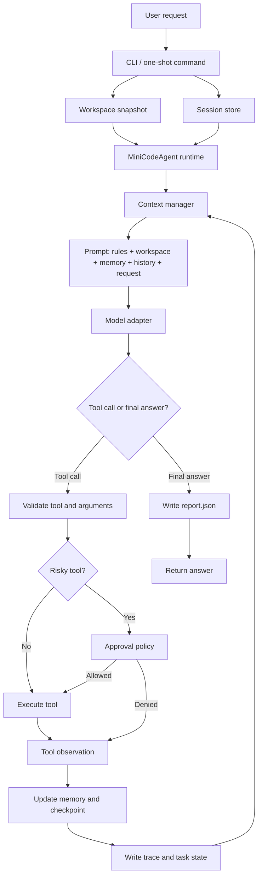

# MiniCodeAgent

MiniCodeAgent is a lightweight local coding agent runtime for repository-oriented tasks. It runs in the terminal, inspects the current workspace, calls a bounded set of tools, and stores session state and run artifacts locally under `.minicodeagent/`.

The project focuses on the runtime layer behind coding agents: workspace context, model adapters, tool execution, approval control, memory, checkpointed resume, trace logging, and reproducible run reports.

## What It Does

- Inspects repository structure and important project documents before acting.
- Reads files, searches code, writes patches, and runs shell commands through explicit tools.
- Keeps conversation history, compact working memory, and checkpoint metadata across turns.
- Supports local run artifacts for debugging and review: `task_state.json`, `trace.jsonl`, and `report.json`.
- Works with Ollama, OpenAI-compatible Responses API, Anthropic-compatible Messages API, and DeepSeek's Anthropic-compatible endpoint.
- Supports risky-tool approval modes: `ask`, `auto`, and `never`.

## Runtime Flow



## Project Layout

```text
minicodeagent/
  cli.py              CLI assembly and interactive loop
  runtime.py          Agent control loop, approval, trace, checkpoints
  tools.py            Built-in workspace tools
  context_manager.py  Prompt section budgeting and history reduction
  memory.py           Working memory and durable topic notes
  models.py           Provider adapters
  run_store.py        Local run artifacts
  skills.py           Repository-local skill discovery
  task_state.py       Per-run task status model
tests/                Regression tests for runtime, tools, memory, safety, metrics
skills/               Local task workflow summaries injected into the prompt
benchmarks/           Scripted benchmark tasks
docs/                 Public architecture and review notes
```

## Install

MiniCodeAgent requires Python 3.10+.

With `uv`:

```bash
uv sync
```

With pip:

```bash
pip install -e .
```

## Quick Start

Run in the current repository:

```bash
uv run minicodeagent --provider deepseek
```

Run against another workspace:

```bash
uv run minicodeagent --cwd /path/to/repo --provider deepseek
```

Run a one-shot task:

```bash
uv run minicodeagent --provider deepseek "inspect the test failures and propose a fix"
```

If installed in the current environment:

```bash
python -m minicodeagent --provider deepseek
```

## Configuration

MiniCodeAgent loads `.env` from the workspace root. Keep real keys in `.env`; only `.env.example` should be committed.

Configuration priority:

```text
CLI arguments > MINICODEAGENT_* environment variables > legacy provider variables > defaults
```

Example:

```bash
cp .env.example .env
```

### Ollama

```bash
ollama serve
ollama pull qwen3.5:4b
uv run minicodeagent --provider ollama --model qwen3.5:4b
```

### OpenAI-Compatible

```bash
MINICODEAGENT_OPENAI_API_BASE="https://your-api.example/v1"
MINICODEAGENT_OPENAI_API_KEY="your-api-key"
MINICODEAGENT_OPENAI_MODEL="gpt-5.4"
uv run minicodeagent --provider openai
```

### Anthropic-Compatible

```bash
MINICODEAGENT_ANTHROPIC_API_BASE="https://your-api.example/v1"
MINICODEAGENT_ANTHROPIC_API_KEY="your-api-key"
MINICODEAGENT_ANTHROPIC_MODEL="claude-sonnet-4-6"
uv run minicodeagent --provider anthropic
```

### DeepSeek

```bash
MINICODEAGENT_DEEPSEEK_API_KEY="your-api-key"
MINICODEAGENT_DEEPSEEK_MODEL="deepseek-v4-pro"
uv run minicodeagent --provider deepseek
```

## Interactive Commands

- `/help`: show commands
- `/memory`: show distilled working memory
- `/session`: show the current session file path
- `/reset`: clear current session history and memory
- `/exit` or `/quit`: exit the REPL

## Safety And Persistence

MiniCodeAgent treats shell execution and file writes as risky actions. Risky tools are controlled by:

```bash
--approval ask
--approval auto
--approval never
```

Run artifacts are written locally:

```text
.minicodeagent/runs/<run_id>/
  task_state.json
  trace.jsonl
  report.json
```

These artifacts are local debugging and review data; they are ignored by git.

Review recent runs without opening JSON files:

```bash
uv run minicodeagent runs
uv run minicodeagent report latest
```

`runs` lists stored run ids with status and stop reason. `report latest` prints a compact summary of the latest run, including requested tools, risky-tool denials, files read, and files modified.

## Development

Run tests:

```bash
python -m pytest tests -q
```

Run lint if Ruff is installed:

```bash
uv run ruff check .
```
