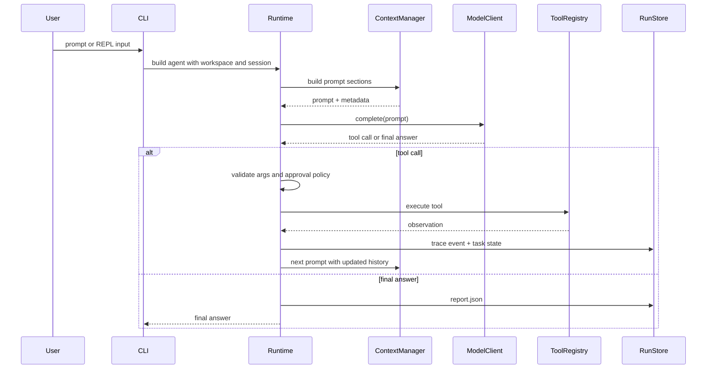

# MiniCodeAgent Agent Harness v1 Overview

MiniCodeAgent is a compact local coding-agent runtime. It is intentionally organized around a small control loop instead of a large framework dependency: build context, ask the model, validate a tool call, execute the tool, record the result, and continue until a final answer is produced.

## Runtime Responsibilities

- Build a workspace snapshot from git status, recent commits, and project documents.
- Maintain session history, working memory, file summaries, durable topic notes, and checkpoint metadata.
- Assemble prompts with section budgets for rules, workspace facts, memory, relevant notes, history, and the current request.
- Parse model output into a tool call or final answer.
- Validate tool arguments and enforce approval policy before risky operations.
- Write task state, trace events, and final run reports under `.minicodeagent/runs/<run_id>/`.

## Core Data Flow

## Tool Boundary

The tool layer is the boundary between model intent and the local machine. Read-only tools such as file listing, reading, and search are treated differently from risky tools such as shell execution, file writes, and patching. The runtime validates every tool call before execution and applies the configured approval policy.

## Task State And Artifacts

Each run has a task state object that records attempts, tool steps, status, stop reason, checkpoint id, and final answer. The run store writes three local artifacts:

- `task_state.json`: structured state for the current run.
- `trace.jsonl`: append-only event stream for prompt construction, model calls, tool execution, checkpoints, and finalization.
- `report.json`: final summary designed for debugging and review.

## Why This Shape

This architecture keeps the agent understandable and testable. Provider adapters hide API differences, the context manager owns prompt budgeting, the runtime owns control flow, and tools own local side effects. That separation makes it easier to add safety, observability, and extension features without turning the core loop into a tangle.
